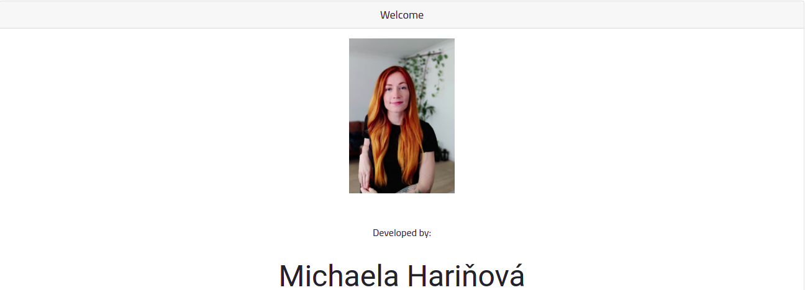
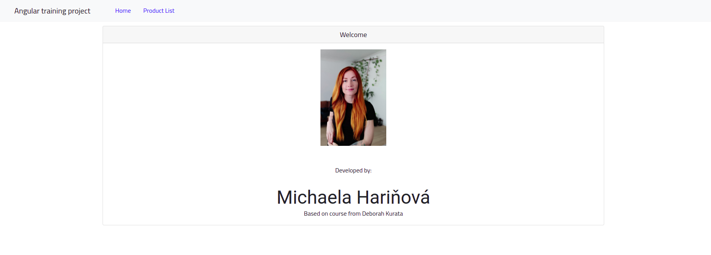
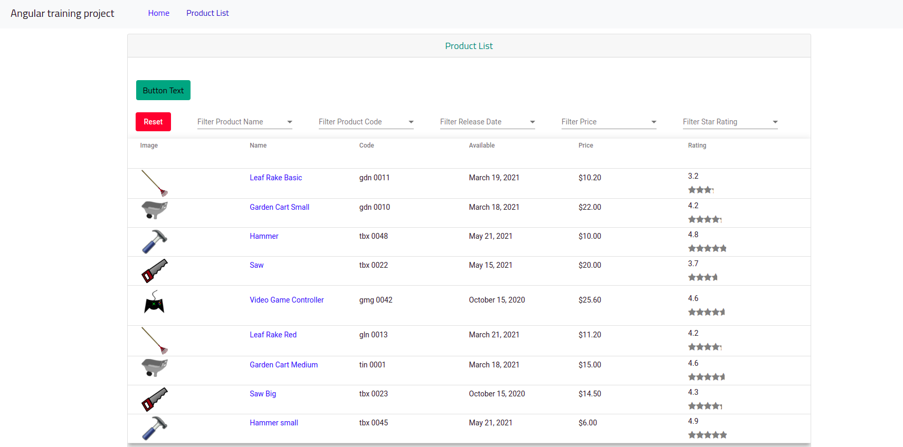
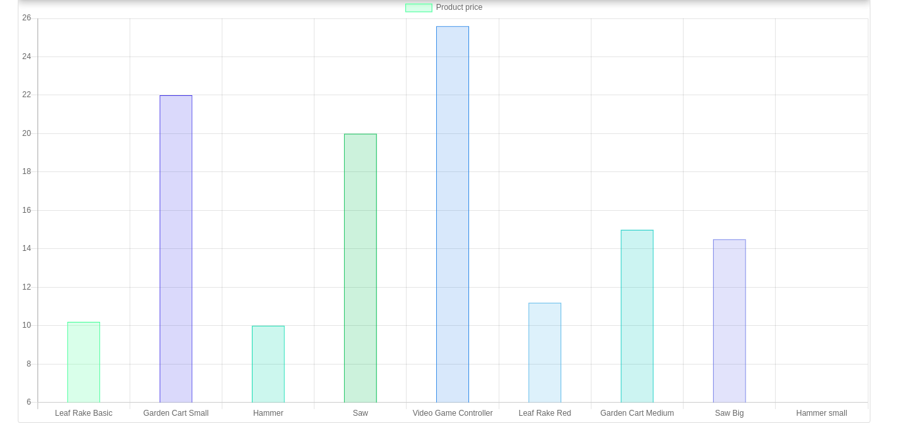
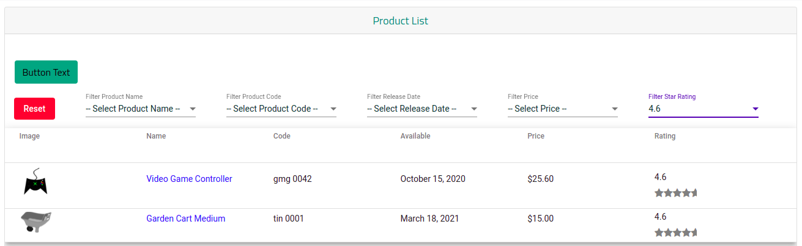
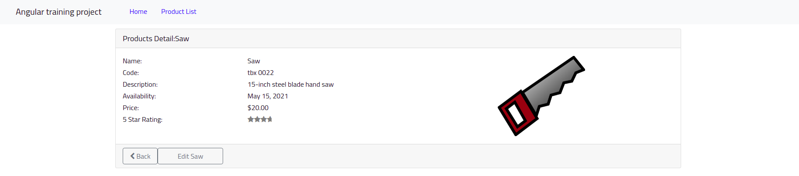

# angular_exercises - APM

[Michaela Harinova- LinkedIn](https://www.linkedin.com/in/michaela-hari%C5%88ov%C3%A1-a0a7131b8/)

## I'm junior web develper and this is my current project which I stated in order to prepare for my internship.

&nbsp;
***********************************************************************
&nbsp;

# About 
>## APM - Angular Products Model 
>
> The purpose of this project is to test and implement new things and components.   
>
> The very first version of this project was based on a course from Deborah Kurata where I brushed up some basics and fundamentals of Angular.  
>
> However, I was adding more functionality, components and complexity what led me to refactoring the original project.

&nbsp;

# Used technologies:
>- MEAN stack
>    - Node.js
>    - Express
>    - MongoDB
>    - Angular
>      - Material
>      - CDK
>
>- TypeScript
>- CSS
>- Bootstrap
>- HTML
>
>- Storybook    

&nbsp;

# Learning objectives
 - MongoDB (Mongoose) + Node.js + Express -> database creation and connection  
 - Correct structuring of models and its components
 - Implementing components in stories.
 - Learning of implementation of Angular Material and Chart.js.

&nbsp;       

# The Mission
 I'm learning how to use new tools and implement different components based on tasks and requirements that I'm getting from my mentor.

&nbsp; 

 * Create a products list with chart.     
 * User must be able to see detail of each product and be able to edit it. 
   
&nbsp; 

 * Create an advanced filtering.     
 * Filetring data externaly with query.  
 * Show query endpoint in URL. 

&nbsp;

# Interface of APM project
>
>### Welcome page
>
>
>### Products list with its chart
>
>
>
>### Filtered products
>
>
>### Detail of a product
>  
>
>#### Edit product's price
>
